# Software Development Plan: Burger Game

>
> GitHub repository link: [https://github.com/petitejess/burger_game.git](https://github.com/petitejess/burger_game.git)
>
>
> RubyGems repository link: [https://rubygems.org/gems/burger_game](https://rubygems.org/gems/burger_game)
>

&nbsp;

<!-- TABLE OF CONTENTS -->
<details open="open">
  <summary>Table of Contents</summary>
  <ol>
    <li>
      <a href="#purpose">Purpose</a>
      <ul>
        <li><a href="#what-it-does">What It Does</a></li>
        <li><a href="#problems-and-solutions">Problems and Solutions</a></li>
        <li><a href="#target-audience">Target Audience</a></li>
        <li><a href="#how-they-use-it">How They Use It</a></li>
      </ul>
    </li>
    <li>
      <a href="#features">Features</a>
      <ul>
        <li><a href="#main-features">Main Features</a></li>
        <li><a href="#supporting-features">Supporting Features</a></li>
      </ul>
    </li>
    <li>
      <a href="#user-interface-and-user-experience">User Interface and User Experience</a>
      <ul>
        <li><a href="#how-users-find-features">How Users Find Features</a></li>
        <li><a href="#how-users-use-features">How Users Use Features</a></li>
        <li><a href="#how-errors-handled-and-displayed">How Errors Handled and Displayed</a></li>
      </ul>
    </li>
    <li>
      <a href="#flowchart-diagram">Flowchart Diagram</a>
    </li>
    <li>
      <a href="#implementation-plan">Implementation Plan</a>
      <ul>
        <li><a href="#trello-summary">Trello Summary</a></li>
        <li><a href="#trello-screenshots">Trello Screenshots</a></li>
      </ul>
    </li>
    <li>
      <a href="#installation-and-usage">Installation and Usage</a>
      <ul>
        <li><a href="#prerequisites">Prerequisites</a></li>
        <li><a href="#ruby-gem-installation-and-usage">Ruby Gem (Installation and Usage)</a></li>
        <li><a href="#bash-script-installation-and-usage">Bash Script (Installation and Usage)</a></li>
        <li><a href="#dependencies">Dependencies</a></li>
      </ul>
    </li>
    <li><a href="#acknowledgements">Acknowledgements</a></li>
  </ol>
</details>

&nbsp;  

## Purpose

This text-based Ruby terminal game app demonstrates the level of understanding of terminal applications, programming fundamentals, such as variables (and their scope), iteration/conditional control structures, methods, objects, classes, error handling, etc. It also demonstrates the level of understanding of algorithm, Object-Oriented Programming (OOP) principles (encapsulation, abstraction, inheritance, and polymorphism) and Test Driven Development (TDD) approach.

### What It Does

This simple text-based Ruby *terminal game app*, simulates a burger shop, where you need to build the meal for the customers with different requests and preferences.

Players would find themselves as the owner of a Ruby burger shop and they will have to memorise their menu. First, they want to identify the burger name with the ingredients, and the quantity needed for each ingredient. Next, they want to memorise the stack order of the burger, as they will need to build the burger stack from bottom up. When customers show up, they will give an order and state their preferences. Players would need to add or reduce the quantity that the customers have preferred and build the burger.

The winning condition is when players reach the target *money* goal, and the losing condition is when the shop’s *reputation* drops to 0 (zero).

### Problems and Solutions

This app is developed for entertainment purpose in a form of a mini perception and memory test game. It also helps people to learn to pay attention to small details, such as when customers are expressing their preferences in a form of a sentence.

On the developer's perspective, this app provides an exercise on programming fundamentals, OOP concepts and TDD process using Ruby programming language and RSpec as the tool.

### Target Audience

The gameplay offered by this app is suitable for people who like memory/puzzle games or text-based terminal games. The game only requires basic Math (addition and subtraction) and basic English command knowledge.

This game could provide entertainment for people who likes role-playing, where they might be curious of what the customers’ responses be when they are either happy, neutral, or angry.

### How They Use It

For people who likes memory/puzzle games, this might be a challenge as they would need to memorise quite a lot of things. They would also need to interpret a short and sometimes indirect instruction of what is expected for the result. A basic addition or subtraction is involved to solve each problem.

For people who likes role-playing games, they may find it somewhat interesting. Each customer in the game has different responses for each different mood (happy, neutral, angry). That may encourage people to intentionally make the customers angry just to see the responses.

&nbsp;

---

&nbsp;

## Features

This app consists of a total of seven features that can be separated into two categories, Main Features and Supporting Features. Basically, the Main Features have the bare minimum things that make this app works and the Supporting Features adds functionalities to increase user experience.

### Main Features

#### 1. Selectable options (ingredient list) and text input validation

Users are given selectable options for list of ingredients to choose from, so no manual ingredient name typing is necessary. **TTY Prompt** gem is used to handle the selection input and formatting. Users will only have to move arrow key up and down, and press Enter key to select one of the available options.

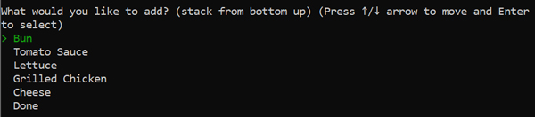

Input for ingredient quantity is of the number data type (integer) within a pre-set range of 0 to 5. Regex validation using *while conditional* statement is used to handle input, to prompt user input again if it does not pass validation.

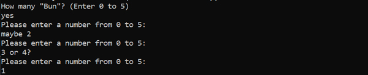

#### 2. Score Calculation

Score in the game is calculated based on comparison between user input and expected solution for each problem (customer’s request and preference). One (1) point is added to the score for every ingredient correctly selected with correct quantity entered in the correct order.

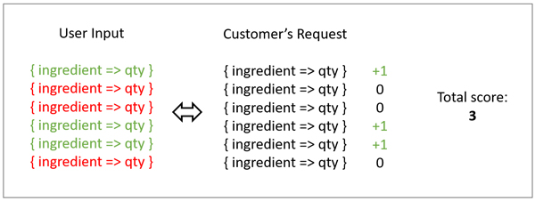

Score calculations are done in a method within a class and are made by looping through user input which is an array of hashes, using *each with index loop* comparing a set of ingredient-quantity from user with the set of expected ingredient-quantity requested in an orderly manner.

The total score is stored in an *instance variable* where it would then be checked again using nested *if-elsif-else conditional* statement in another method in the same class to get the correct the mood, which also stored in an *instance variable*. The mood is used in another method in the same class going through another nested *if-elsif-else conditional* statement to manipulate winning/losing criteria calculation.

#### 3. Winning and Losing Conditions

The total score is used to get customer’s mood, to display appropriate text response. The mood is used again to update current money and rep status.

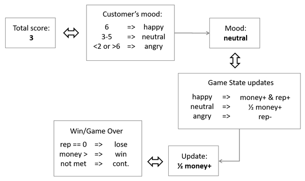

There are two conditions that control the game’s flow of winning and losing. Users win the game if the current money reaches the target money. Users lose the game if current shop's reputation gets to 0.

These two values are stored in *class variables* in GameState class. The calculation from the previous feature (Score Calculation) counts toward these class variables. The *if conditional* control flow is used to handle the output of winning or losing scene. **TTY Box** gem is used to format the output on the screen, and **Artii** gem is used to style Game Over text message. 

### Supporting Features

#### 1. Options to View Instructions or Start Game

Users will have the options to view instructions of how to play the game or to start the game.

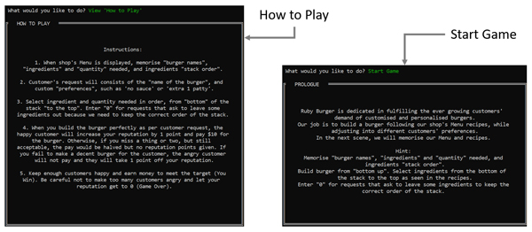

A *loop do-end* is used to bring users back to home screen after they finish reading the instructions. The *if conditional* statement, based on users’ input (from option selections), is used to break out of the loop to continue the game if user input chooses Start Game. **TTY Box** gem is used to format the message output on the screen.

#### 2. Shop’s Menu Display

The menu consists of several recipes that are stored as JavaScript Object Notation (JSON) format in a file. **JSON** gem is used to parse the file into Ruby data structure. Nested *each loop* is used to go through each data structures to get the values.

Error handling is used to rescue error while reading the JSON file. The error is handled using *begin-rescue-end* block, for error from not finding the file in destination, as well as standard error.

**TTY Box** and **Colorize** gems are used to add styling to the output, adding box and coloured accent to the recipe display printed to the screen. The *loop-do-end* is used to print all recipes on the screen.

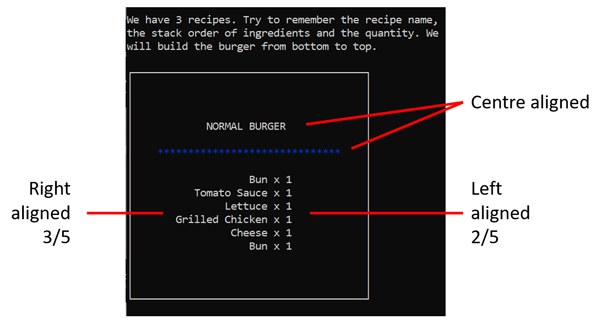

Each recipe displayed inside a box, with the name of the burger (title) on the first line, separated by a divider (***), followed by ingredient-quantity listed line per line.

#### 3. Randomised Customers

To make the app a little bit more interesting, a random element is brought to the game play. Instead of going through the array of customer data sets in an orderly manner, customers’ data are pulled randomly using `rand()` method.

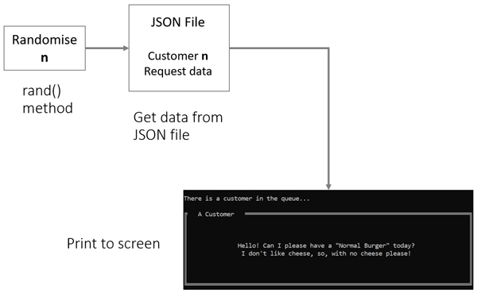

A randomised number (within length of the array of customer data sets) is generated, then used to call the data set for customer with the said index in the customer array. Then the appropriate customer’s request is displayed. Also, after score calculation, the customer’s response is given based on the mood (happy, neutral, or angry), controlled by *if conditional* statement.

#### 4. Customer Response Display

Each customer has different responses for each mood. There are *happy*, *neutral*, and *angry* types of mood and each has different text response. All these requests and responses are stored as JavaScript Object Notation (JSON) format.

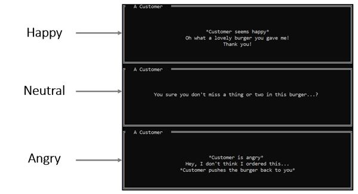

The app reads the file and parse the content to serve the correct text request or response belonging to each customer for the correct type of mood. The **JSON** gem is used to parse the data into Ruby data structure and nested *each* loop used to go through the array of hashes. Then, **TTY Box** is used to format the output on the screen.

Error handling is used to rescue error while reading the JSON file. The error is handled using *begin-rescue-end* block, for error from not finding the file in destination, as well as standard error.

&nbsp;  

---

&nbsp;

## User Interface and User Experience

This section will explain a narrative of how users will find out how to use each feature, use those features, and how errors are handled by the app and displayed to users.

### How Users Find Features

Users will be able to find out the available options that can be used for command line arguments from the usage information in the README.md file in the app root directory.

After installing and running the app, once users choose to launch the game, after viewing prologue message, users will be able to find the features starting from *start menu options*.

Once users choose to start the game, they will find the *shop's menu display* feature. All the available recipes in the shop's menu will be displayed to users.

After that, users will find the *randomised customer* feature, where they will see a request message from a random customer.

Next, users will find the *selectable options and text input validation* feature through input prompt of ingredients list and input prompt for ingredient quantity.

Users will then find the *score calculation* feature as the app compares the collection of their inputs with the expected result.

After the app calculates the score, users will be able to find the *customer response display* feature, where a response message is given accordingly.

Users will be able to find the last feature, *winning and losing conditions*, when they make progress through the game and game state is changed.


### How Users Use Features

Users use the command line arguments to set custom values for target money and maximum reputation to make the game easier or hard.

The *start menu options* feature provides two options, where users can choose to view the instructions of how to play the game or to start the game.

The *shop's menu display* feature displays each recipe in a neat format for users to easily glance the recipe to memorise the details.

Users get a random customer request from *randomised customer* feature each time.

Users enter input for ingredient name and quantity using the *selectable options and text input validation* feature. They can select ingredient using up/down arrow keys and enter quantity with numbers between 0-5. If they enter a value other than whole number 0 to 5 for the quantity, they will be prompted again.

Users use the *score calculation* feature to get the customer's mood that is used to display appropriate customer's response.

Users use *customer response display* feature to find out if the customer is happy (score is perfect), neutral (score is within threshold), or (score is bad) angry.

Users use the *winning and losing conditions* feature to reach the end of the game. The game can finally end when users meet on the conditions, when current money reaches target money (Win) or when current reputation gets to 0 (Game Over).

### How Errors Handled and Displayed

#### Error Handling for Command Line Argument

Error handling for command line argument is handled by the *begin-rescue-end* block that would rescue invalid option, missing argument, parse error, and other errors.

As per installation and usage information, upon running the app, users will have the options to raise or lower the bar for winning and losing criteria using the command line argument(s). This can be done by entering the desired option(s) and value(s) through command line when running the app. Complete information can be found in Installation and Usage section in README.md document or by opening the Help menu for this app in command line using option `-h` or `--help`.

Errors from command line argument parsing within the app are handled by the below block of rescue code:

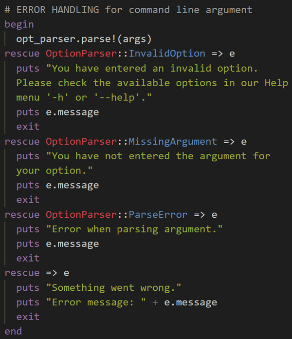

Custom error messages are given, followed by the message from the instance of the exception.

#### Error Handling for File Not Found

Error handling for reading JSON files is handled by the *begin-rescue-end* block that would rescue file not found error and other errors.

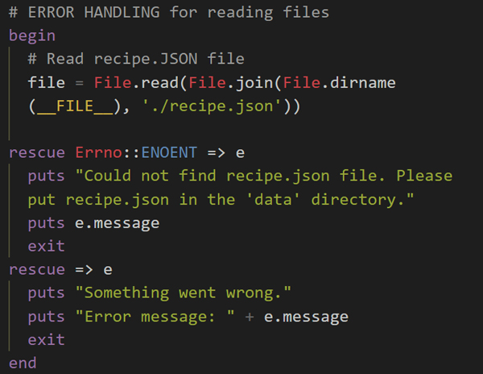

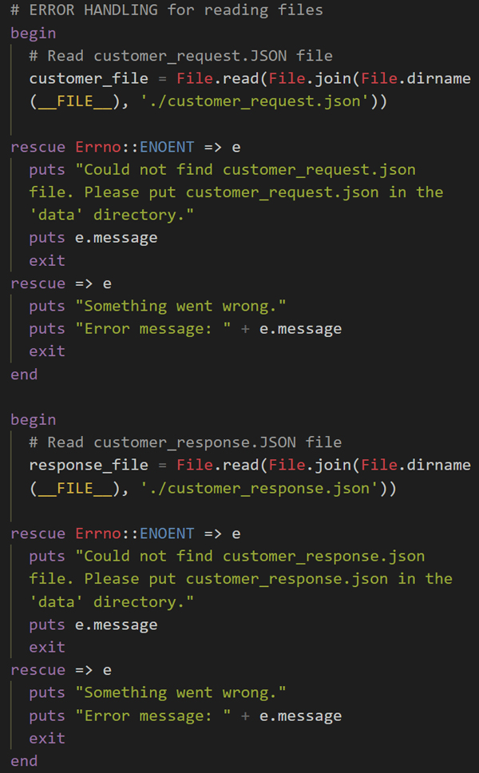

Custom error messages are given, followed by the message from the instance of the exception.

&nbsp;  

---

&nbsp;

## Flowchart Diagram

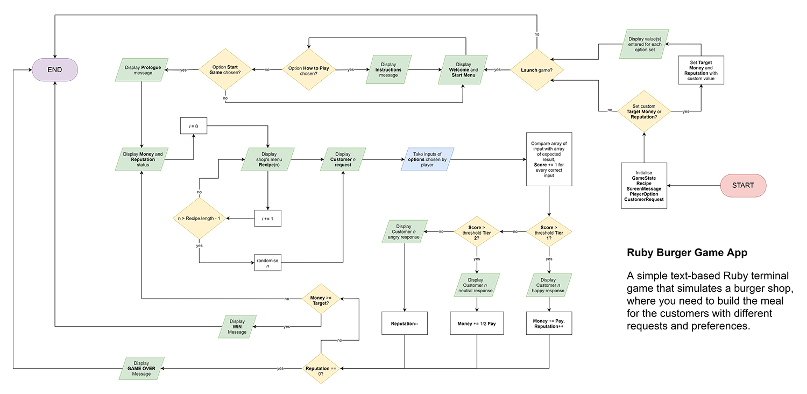

&nbsp;

---

&nbsp;

## Implementation Plan

Trello project management tool was used to manage the app development.

>
> Trello board link: https://trello.com/b/wPtcTui7
>  

### Trello Summary

Initial plan showed that features were separated between three main features (in Main Features list) and four supporting features (in Backlog list). 

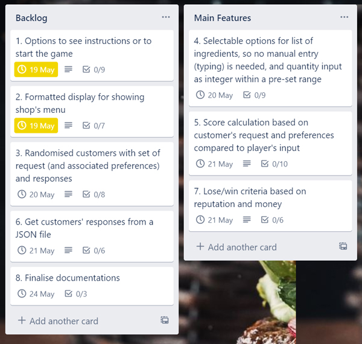

&nbsp;

#### Feature 1: Options to see instructions or to start the game

*(Due Date: 19 May 2021 17:00)*

Description: When players run the app, they will be greeted with a welcome message on home screen where they have 2 options to choose from:

- How to Play: If players choose the How to Play option, instructions of how to play the game will be shown on screen. At the end of the instructions, players will find option to go back to home screen.
- Start Game: If players choose the Start Game option, the game will start and continue to the next scene where they will be shown a prologue.

**Tasks:**

- [x] Prepare instructions message
- [x] Prepare prologue
- [x] Prepare instructions message
- [x] Look for Gem for table display
- [x] Create UI
- [x] Create test case for display
- [x] Create code to pass test

**Code Implementation:**

- [x] If-else statement for options
- [x] Loop for user input
- [x] Import Gem, utilise function(s)

&nbsp;

#### Feature 2: Formatted display for showing shop's menu

*(Due Date: 19 May 2021 17:00)*

Description: Players will be shown the shop's menu in a format that helps them to easily memorise things.

**Tasks:**

- [x] Create shop’s menu
- [x] Look for Gem to colorise text
- [x] Create UI
- [x] Create test case for display
- [x] Create code to pass test

**Code Implementation:**

- [x] Loop to display each menu item
- [x] Import Gem, utilise function(s)

&nbsp;

#### Feature 3: Randomised customers with set of request (and associated preferences) and responses

*(Due Date: 20 May 2021 17:00)*

Description: Players will get requests from various randomised customers with their set of request and associated preferences. Once customers' requests are fulfilled, score is calculated, then customer response is displayed based on score.

**Tasks:**

- [x] Create customers and their sets
- [x] Prepare customer responses
- [x] Create UI
- [x] Create test case for display
- [x] Create code to pass test

**Code Implementation:**

- [x] Loop through data structure
- [x] Use rand() for random customer implementation

&nbsp;

#### MAIN Feature 4: Selectable options for list of ingredients, so no manual entry (typing) is needed, and quantity input as integer within a pre-set range

*(Due Date: 20 May 2021 17:00)*

Description: Players will be given selectable options for list of ingredients to choose from, so no manual ingredient name typing is needed. Input for quantity will be of number data type (integer) within a pre-set range of 0 to 5.

**Tasks:**

- [x] Look for Gem for input selection formatting
- [x] Create UI
- [x] Create test case for display
- [x] Create test case for option input
- [x] Create user input validation
- [x] Create code to pass tests

**Code Implementation:**

- [x] Loop for user input
- [x] Import Gem, utilise function(s)

&nbsp;

#### MAIN Feature 5: Score calculation based on customer's request and preferences compared to player's input

*(Due Date: 21 May 2021 17:00)*

Description: Score will be calculated based on comparison between customer's request/preferences and player's input. Ideally score +1 for every ingredient correctly selected with correct quantity entered by players. Check if total score meets certain threshold to give appropriate customer's response and provide values to be used in calculation for money and reputation.

**Tasks:**

- [x] Create test case for comparison calculation
- [x] Create test case for correct customer response type
- [x] Create test case for correct calculation towards money and reputation
- [x] Create code to pass tests

**Code Implementation:**

- [x] Loop through data structure for comparison calculation
- [x] If-elsif-else statement for score threshold
- [x] Switch case statement for different types of customer responses
- [x] If-elsif-else statement for giving value to add money or reduce reputation

&nbsp;

#### Feature 6: Get customers' responses from a JSON file

*(Due Date: 21 May 2021 17:00)*

Description: Various customers' happy, neutral, angry responses are stored in a JSON file, used in the code by parsing it.

**Tasks:**

- [x] Look for Gem for JSON parsing
- [x] Prepare JSON file populated with happy, neutral, angry customer responses
- [x] Create test case for display
- [x] Create code to pass tests

**Code Implementation:**

- [x] Import Gem, utilise function(s)

&nbsp;

#### MAIN Feature 7: Lose/win criteria based on reputation and money

*(Due Date: 21 May 2021 17:00)*

Description: Players will lose the game once their reputation value hits zero (0). Players will win the game once they reach the target money. Once players meet the losing/winning criteria, they will be shown either Game Over or Win message and that will be the end of the game.

**Tasks:**

- [x] Prepare Game Over message
- [x] Prepare Win message
- [x] Create UI
- [x] Create test case for display
- [x] Create code to pass tests

**Code Implementation:**

- [x] If-else statement for win/lose

&nbsp;

### Trello Screenshots

Initial plan:

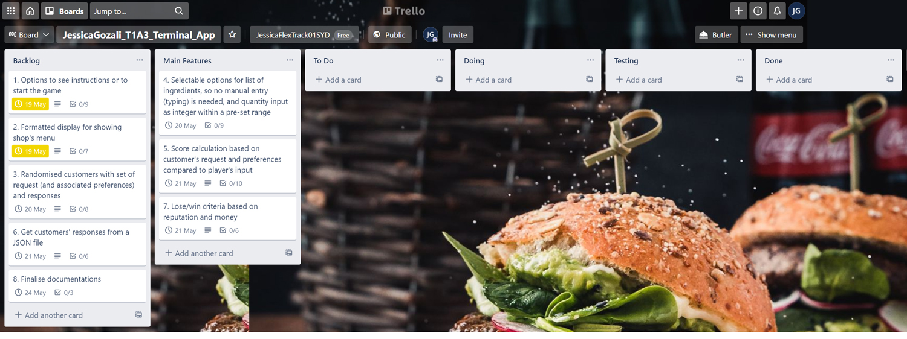

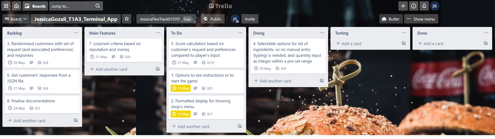

&nbsp;

<!-- Trello Screenshots of Implementation Records -->
<details>
  <summary>... List of Other Screenshots of Implementation Records</summary>

  &nbsp;

  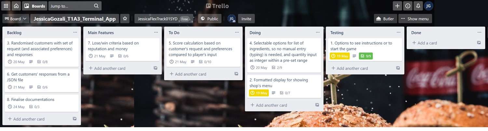

  

  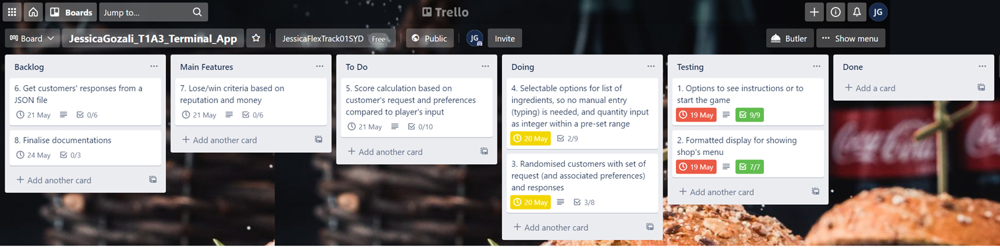

  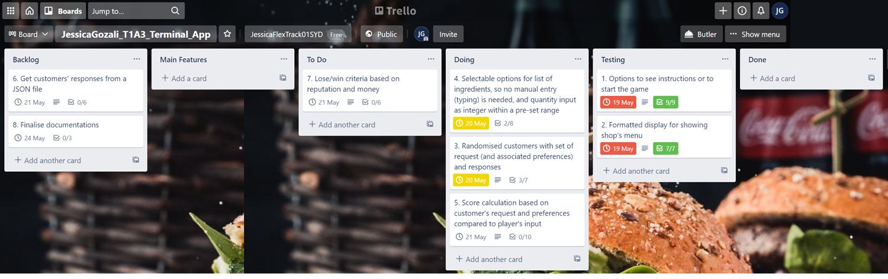

  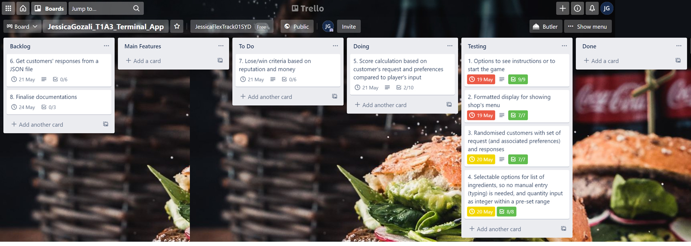

  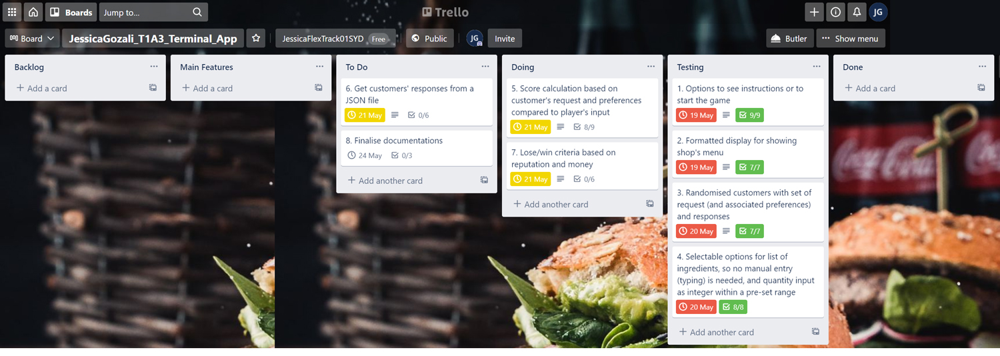

  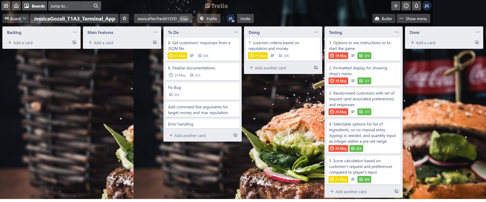

  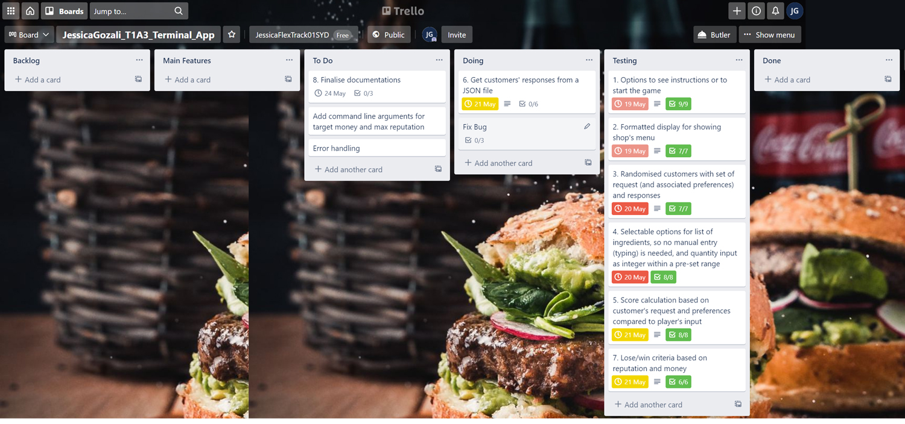

  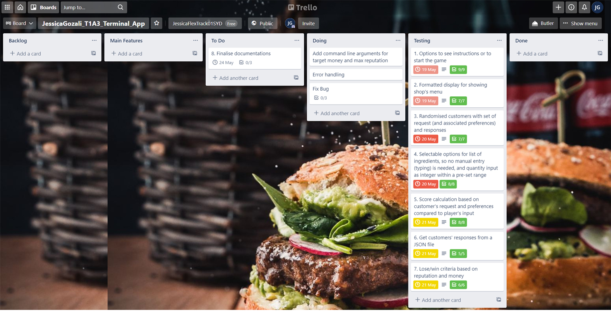

  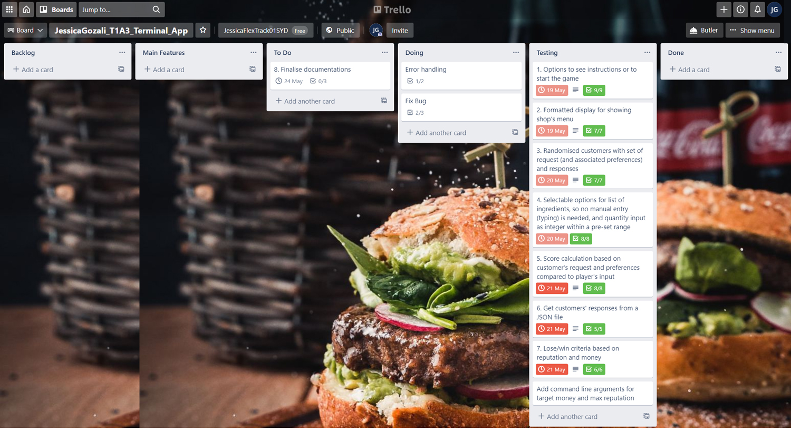

  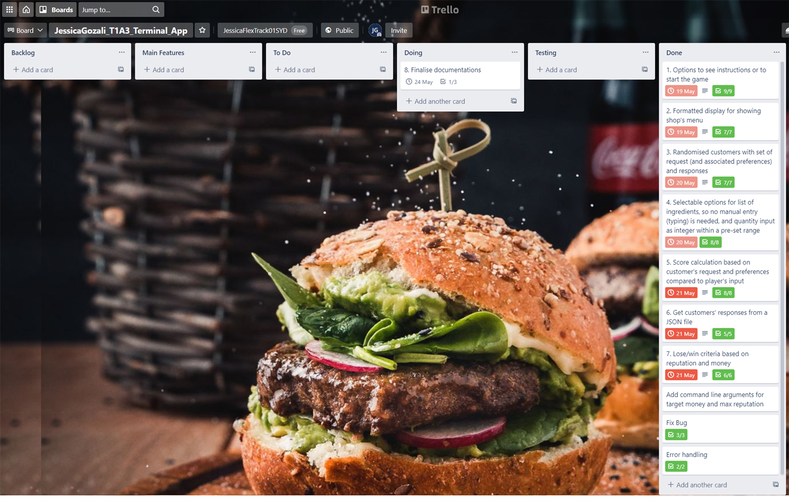
</details>

&nbsp;

Last stage:

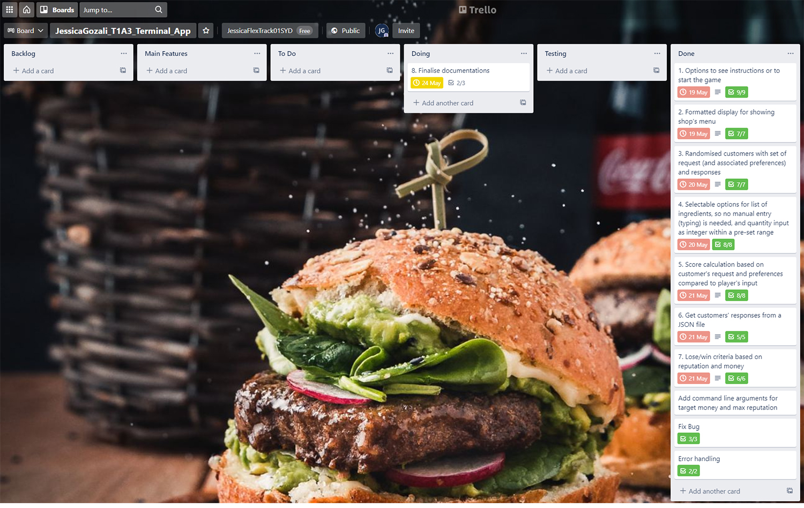

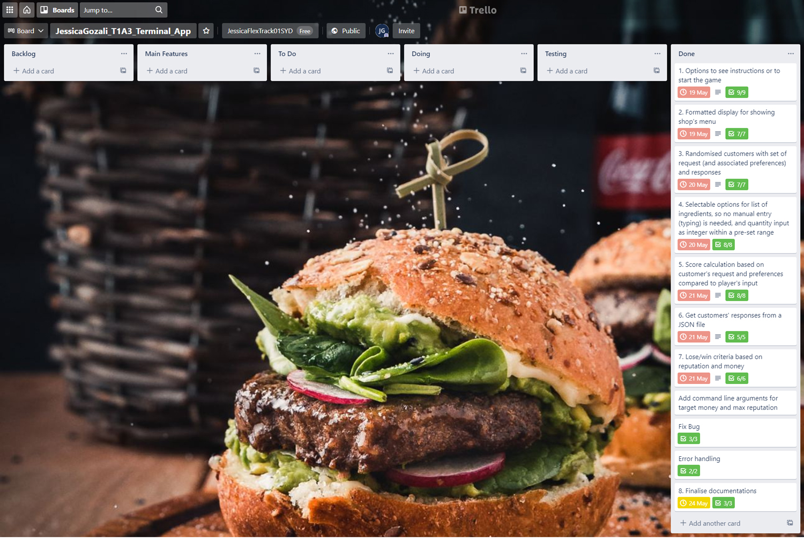

&nbsp;

---

&nbsp;

## Installation and Usage

There are two options available to install Burger Game app: **Ruby Gem** or **Bash Script**. This is assuming the prerequisites are met prior to installation attempt.

Please see below guidelines and instructions for installation options and usage.

### Prerequisites

The app has been tested using below systems:

| Platform | Operating System | Description |
|:---:|:---:|:---|
| Windows | Windows 10, Windows 7 SP1 | Tested for Ruby Gem: installation and usage |
| macOS | macOS Mojave 10.14 | Tested for Ruby Gem and Bash Script: installation and usage |
| Linux | Ubuntu Focal Fossa 20.04 LTS | Tested for Ruby Gem and Bash Script: installation and usage |

&nbsp;

#### Install Ruby

This game was built on **Ruby version 2.7.3**. This is the minimum requirement for the app to run as intended. To check Ruby version installed in your system, in the terminal, run:

```
ruby -v
```

For Ruby update/installation guide, please refer to the official Ruby documentation: [https://www.ruby-lang.org/en/documentation/installation/](https://www.ruby-lang.org/en/documentation/installation/).

&nbsp;  
&nbsp;  

### Ruby Gem (Installation and Usage)

The most convenient way to install this app is by installing this app as a Gem. Executable file is also available.

Please see below instructions for installation of Burger Game gem.

1. Open terminal, install Burger Game gem:

    ```
    gem install burger_game
    ```
2. To start the game:

    ```
    start_burger_game
    ```
    OR To start the game with **options** (command line arguments):

    ```
    start_burger_game [OPTION]
    ```

**Options** available:

Usage (Gem's executable): start_burger_game [*OPTION*]

- -h, --help:
  - Print this Help menu for Burger Game.
- -m, --money [*TARGET_MONEY*]
  - Change TARGET_MONEY. The lower the value, the easier to WIN. Default is 50. Enter number 10 to 99.
- -r, --reputation [*MAX_REPUTATION*]
  - Change MAX_REPUTATION. The lower the value, the easier to GAME OVER. Default is 10. Enter number 1 to 10.

Examples:

- To view Help menu:

  ```
  start_burger_game -h
  ```
- To set *TARGET_MONEY*:
  ```
  start_burger_game -m 30
  ```
- To set *MAX_REPUTATION*:
  ```
  start_burger_game -r 5
  ```
- To set both *TARGET_MONEY* and *MAX_REPUTATION*:
  ```
  start_burger_game -m 30 -r 5
  ```

&nbsp;  
&nbsp;  

### Bash Script (Installation and Usage)

Another way to install this app is by using the bash script.

1. Clone from repository:

    ```
    git clone https://github.com/petitejess/burger_game.git
    ```
2. Change directory:

    ```
    cd burger_game/src/
    ```
3. Run script to install and run the app the first time:

    ```
    ./install.sh [OPTION]
    ```
    - The next time you want to only run the game (no need to install again), just run the script:
      ```
      ./burger_game.sh [OPTION]
      ```

**Options** available:

Usage (bash script - install game): ./install.sh [*OPTION*]

Usage (bash script - run game): ./burger_game.sh [*OPTION*]

- -h, --help:
  - Print this Help menu for Burger Game.
- -m, --money [*TARGET_MONEY*]
  - Change TARGET_MONEY. The lower the value, the easier to WIN. Default is 50. Enter number 10 to 99.
- -r, --reputation [*MAX_REPUTATION*]
  - Change MAX_REPUTATION. The lower the value, the easier to GAME OVER. Default is 10. Enter number 1 to 10.

Examples:

- To view Help menu:

  ```
  ./burger_game.sh -h
  ```
- To set *TARGET_MONEY*:
  ```
  ./burger_game.sh -m 30
  ```
- To set *MAX_REPUTATION*:
  ```
  ./burger_game.sh -r 5
  ```
- To set both *TARGET_MONEY* and *MAX_REPUTATION*:
  ```
  ./burger_game.sh -m 30 -r 5
  ```

&nbsp;  
&nbsp;  

### Dependencies

Gem dependencies are handled by *add_runtime_dependency* when installing with Ruby Gem installation option, and by *Bundler* gem when installing with Bash Script installation option. The information below is only for reference.

List of Gems used in building the app:

| Gem Name | Version | Description |
|:---:|:---:|:---|
| artii | v.2.1 | Used for text formatting |
| colorize | v.0.8.1 | Used for text formatting |
| json | v.2.5 | Used to parse JSON file |
| tty-box | v.0.7.0 | Used for border/table formatting |
| tty-prompt | v.0.23.1 | Used for user input with selectable options|
| rspec | v.3.10 | Used for code testing |
| bundler | v.2.2 | Used for gem dependencies |

&nbsp;

---

&nbsp;

## Acknowledgements

- ASCII Art:
    - Image of a burger and chips created with ASCII characters included in the app (in Win message) is owned by **Joan G. Stark** and attribution is given as per directed by the artist.

- Ruby Gems
    - TTY Prompt, TTY Box, Artii: MIT Licence
    - Colorize: GPL-2.0 Licence
    - JSON: Ruby Licence
